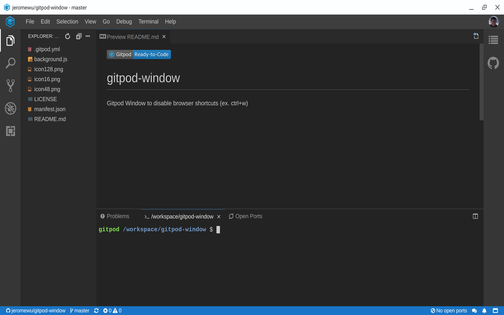

# Gitpod Window

 

Gitpod Window offers you an immersive IDE experience with minimal UI and shortcuts.

\* This is NOT an official extension from Gitpod

The goal of this extension is to provide a improved Gitpod online IDE experience. What is does is opening a Chrome popup window with:

- Minimal Chrome Interface (see screenshot)
- Full Keyboard Shortcuts (incl. Ctrl-W, Ctrl-N, Ctrl-T and more)

If you would like to learn how to write a Chrome Extension like this, check: [I wrote a Chrome Extension (Gitpod Window). Here is what I learned.](https://medium.com/@jeromewus/i-wrote-a-chrome-extension-gitpod-window-here-is-what-i-learned-8583a3a179dd)
